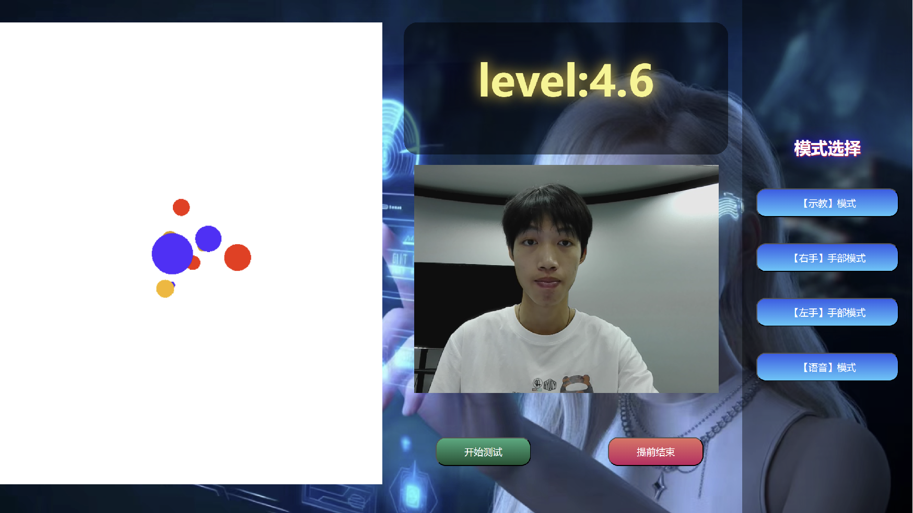

# 视力检测系统

这是一个用于视力检测的Web应用程序，通过标准化的视力测试方法，帮助用户评估自己的视力状况。

## 功能特点

- 用户登录和身份验证
- 视力检测测试
- 结果记录和分析

## 如何使用

1. 首先运行 identify.py 启动视力检测后台算法
2. 打开login.html页面
3. 输入用户名、ID和密码
4. 点击确认按钮进入测试页面
5. 按照指示完成视力检测

## 文件结构及作用

### 算法设计

### 主要页面
- app/login.html - 用户登录界面

- app/text.html - 视力测试主界面

### 样式文件
- app/styles/login.css - 登录页面样式
- app/styles/text.css - 测试页面样式

### 图像资源
- app/picture/ - 包含测试用的图像资源

### 后端脚本
- face_i.py - 面部识别相关功能（无关）
- identify.py - 视力检测后台算法（必须先运行）

## 技术栈

- HTML
- CSS
- JavaScript
- Python
- Java(暂无)

## 后期开发建议

### 数据存储与用户管理

- 引入数据库系统完善登录功能，实现用户数据持久化存储
- 添加用户注册、密码找回等功能

### 后端架构升级

- 考虑使用Python框架如Flask或FastAPI构建完整后端API
- 或使用Java的SpringBoot框架搭建后端服务
- 实现前后端分离架构，提高系统可维护性

### 视力预测功能

- 基于现有数据集训练通用视力预测模型
- 实现视力变化趋势分析和预警功能

### 系统优化

- 改进用户界面，提升用户体验
- 增加数据可视化功能，直观展示检测结果
- 添加多平台支持（移动端适配）

### 协作开发

- 使用GitHub进行版本控制和协作开发
- 建立规范的开发流程和代码审查机制

最新代码将在后续更新中提供，建议团队成员通过GitHub进行协作开发。

## 代码仓库

### GitHub仓库
- HTTPS: https://github.com/D-White-Bear-L/AIVisionTest.git
- SSH: git@github.com:D-White-Bear-L/AIVisionTest.git

### 如何贡献
1. Fork 本仓库
2. 创建您的特性分支 (如：`git checkout -b feature/amazing-feature`)
3. 提交您的更改 (如：`git commit -m '添加某个特性'`)
4. 推送到分支 (如：`git push origin feature/amazing-feature`)
5. 打开一个 Pull Request

## GOOD LUCK  加油！！！